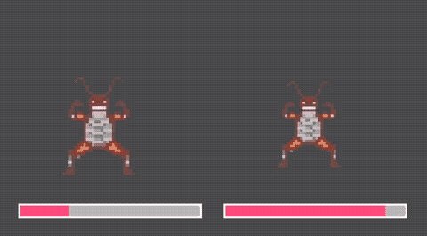

# Fighting Visualiser

live background fighting animation with [Godot](https://godotengine.org/)

## export instructions

Use the Godot export to export an `index.html` file to the `/build/` folder. This will be published to GitHub pages.

## to-do

- think of more game juice
- add game juice
  - screen-shake on hit
  - characters
    - idle animation (bop up down/sprite animation)
    - idle gestures (randomly triggered gestures)
    - hit animation
    - death animation
    - emit particles on hit
  - bars
    - on hit (reduce):
      - emit particles
      - animate (do not jump)
      - blow up/inflate/pop
    - on idle
      - emit particles
- add ease of use
  - reset button
  - sprite chooser
  - in-game sprite uploader?
- export game to website/webpage

## potential future features

- pick-upable items (displayed in middle, temporarily changes sprite sheet)

