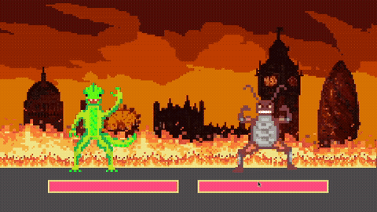

# Fighting Visualiser

live background fighting animation with [Godot](https://godotengine.org/)



## controls:

- `SPACE` - continue/start
- `0`,`1`,`2`,`3`,`4`,`5`,`6`,`7`,`8`,`9`: set power level
- `CTRL + R` / `ESC`: reset
- `LEFT ARROW KEY`: hit left character
- `RIGHT ARROW KEY`: hit right character

## export instructions

Use the Godot export to export an `index.html` file to the `/build/` folder.

Publish this on my server:

```bash
rsync -rv build/* server:/var/www/emporium-fighting-visualiser/
```

## to-do

- think of more game juice
- add game juice
  - characters
    - idle gestures (randomly triggered gestures)
    - hit animation
    - death animation
  - bars
    - on hit (reduce):
      - emit particles
    - on idle
      - emit particles
- add ease of use
  - sprite chooser
  - in-game sprite uploader?
- export game to website/webpage

## further game juice

- sound effects
- Combat BGM
- They should play an attack animation when the opponent gets hit?
- have spectators cheer every time someone gets hit
- Scoreboard/points system???
- Randomize the character overlay colour?
- Random character names
- Introduce the characters at the start with some cool intro animation
- Health number or percentage
- Random taunt animations
- Camera zoom in on character death, slow mo, and then pan to victory character doing a dance with confetti and crowd cheering
- Have the referee show up at the end to announce the winner
- Have sponsored ads in the background
- Remake it all in 3D for enhanced visual entertainment!!!

## potential future features

- pick-upable items (displayed in middle, temporarily changes sprite sheet)

